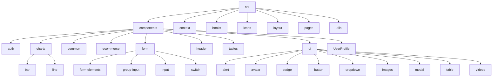
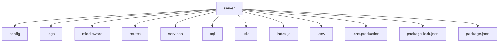

# Struktur Folder Proyek

Berikut adalah penjelasan mendalam mengenai struktur folder `src` dalam proyek ini:

Folder `src` adalah direktori utama yang berisi kode sumber aplikasi frontend. Struktur di dalamnya diorganisir untuk memisahkan berbagai bagian aplikasi berdasarkan fungsinya.

Penjelasan untuk setiap subdirektori:

*   **`components`**: Direktori ini berisi komponen-komponen UI yang dapat digunakan kembali di seluruh aplikasi. Ini dibagi lagi menjadi beberapa sub-folder berdasarkan kategori komponen:
    *   `auth`: Komponen terkait otentikasi (misalnya, form login dan registrasi).
    *   `charts`: Komponen untuk menampilkan berbagai jenis grafik (misalnya, `bar` dan `line`).
    *   `common`: Komponen umum yang digunakan di banyak tempat (misalnya, `PageBreadCrumb`, `ScrollToTop`).
    *   `ecommerce`: Komponen khusus untuk fungsionalitas e-commerce (misalnya, `MonthlySalesChart`, `RecentOrders`).
    *   `form`: Komponen terkait form dan input (misalnya, `date-picker`, `InputField`, `Checkbox`). Ini juga memiliki sub-folder untuk elemen form yang lebih spesifik (`form-elements`, `group-input`, `input`, `switch`).
    *   `header`: Komponen untuk bagian header aplikasi (misalnya, `Header`, `UserDropdown`).
    *   `tables`: Komponen untuk menampilkan data dalam format tabel (misalnya, `BasicTableOne`).
    *   `ui`: Komponen UI dasar (misalnya, `alert`, `button`, `modal`). Ini juga memiliki sub-folder untuk kategori UI yang lebih spesifik (`avatar`, `badge`, `dropdown`, `images`, `table`, `videos`).
    *   `UserProfile`: Komponen terkait tampilan profil pengguna.

*   **`context`**: Berisi file-file yang mendefinisikan React Context untuk manajemen state global (misalnya, `SidebarContext`, `ThemeContext`).

*   **`hooks`**: Berisi custom React hooks yang dapat digunakan kembali untuk logika stateful (misalnya, `useGoBack`, `useModal`).
*   **`icons`**: Berisi file-file SVG atau komponen React yang merepresentasikan ikon yang digunakan dalam aplikasi.

*   **`layout`**: Berisi komponen yang mendefinisikan struktur tata letak halaman aplikasi (misalnya, `AppHeader`, `AppSidebar`, `AppLayout`).

*   **`pages`**: Berisi komponen tingkat halaman yang merepresentasikan tampilan untuk rute atau halaman tertentu dalam aplikasi (misalnya, `Dashboard/Home.tsx`, `AuthPages/SignIn.tsx`). Ini sering kali menggabungkan berbagai komponen dari direktori `components`.

*   **`utils`**: Berisi fungsi-fungsi utilitas atau helper yang digunakan di berbagai bagian aplikasi (misalnya, `exportUtils.js`).

Selain sub-folder tersebut, terdapat juga file-file di tingkat root `src` seperti `App.tsx` (komponen utama aplikasi), `main.tsx` (titik masuk aplikasi), `index.css` (styling global), dan file deklarasi tipe (`svg.d.ts`, `vite-env.d.ts`).

---

Berikut adalah penjelasan mendalam mengenai struktur folder `server` dalam proyek ini:

Folder `server` berisi kode backend aplikasi. Ini adalah bagian yang menangani logika sisi server, interaksi database, API, dan tugas-tugas backend lainnya.

Penjelasan untuk setiap subdirektori dan file utama:

*   **`config`**: Direktori ini kemungkinan berisi file konfigurasi untuk server, seperti pengaturan database (`database.js`, `db.js`).

*   **`logs`**: Direktori ini tampaknya digunakan untuk menyimpan file log server (`combined.log`, `error.log`).

*   **`middleware`**: Berisi fungsi middleware yang digunakan dalam request handling pipeline server (misalnya, `auth.js` untuk otentikasi, `errorHandler.js` untuk penanganan error, `validators.js` untuk validasi input).

*   **`routes`**: Direktori ini mendefinisikan rute API server dan logika penanganannya. Setiap file di sini kemungkinan mewakili sekumpulan rute terkait (misalnya, `authRoutes.js`, `isp.js`, `userRoutes.js`).

*   **`services`**: Berisi logika bisnis inti atau layanan yang digunakan oleh rute (misalnya, `authService.js`, `userService.js`). Ini memisahkan logika bisnis dari definisi rute.

*   **`sql`**: Direktori ini berisi script SQL, kemungkinan untuk membuat tabel database atau operasi database lainnya (`activity_logs.sql`, `users.sql`).

*   **`utils`**: Berisi fungsi-fungsi utilitas atau helper yang digunakan di berbagai bagian kode server (misalnya, `errors.js` untuk penanganan error kustom, `logger.js` untuk logging).

*   **`index.js`**: Ini kemungkinan adalah titik masuk utama untuk aplikasi server.

*   **`.env`** dan **`.env.production`**: File-file ini digunakan untuk menyimpan variabel lingkungan untuk konfigurasi server, memisahkan konfigurasi sensitif dari kode sumber. `.env` biasanya untuk pengembangan lokal, sedangkan `.env.production` untuk lingkungan produksi.

*   **`package.json`** dan **`package-lock.json`**: File-file ini mengelola dependensi proyek server, script, dan metadata lainnya.

---

Berikut adalah penjelasan mengenai file-file yang berada di root direktori proyek:

File-file di root direktori proyek seringkali berisi konfigurasi tingkat proyek, metadata, informasi lisensi, dan file-file penting lainnya yang tidak termasuk dalam direktori `src`, `server`, atau `public`.

Berikut adalah beberapa file penting yang ada di root direktori berdasarkan daftar yang diberikan:

*   **`.gitignore`**: File ini menentukan file dan direktori mana yang harus diabaikan oleh Git. Ini biasanya mencakup file-file yang dihasilkan secara otomatis, dependensi, log, dan file sensitif lainnya yang tidak boleh masuk ke dalam repositori.

*   **`banner.png`**: Ini kemungkinan adalah file gambar yang digunakan sebagai banner atau logo untuk proyek, mungkin ditampilkan di README atau dokumentasi.

*   **`eslint.config.js`**: File konfigurasi untuk ESLint, alat linting kode JavaScript. Ini mendefinisikan aturan dan konfigurasi untuk memastikan konsistensi gaya kode dan mencegah kesalahan.

*   **`index.html`**: Ini adalah file HTML utama untuk aplikasi frontend. Ini adalah halaman yang pertama kali dimuat di browser dan biasanya berisi elemen root tempat aplikasi React akan di-mount.

*   **`LICENSE.md`**: File ini berisi informasi lisensi untuk proyek, yang menentukan bagaimana orang lain dapat menggunakan, mendistribusikan, dan memodifikasi kode.

*   **`package-lock.json`**: File ini secara otomatis dibuat untuk mencatat versi pasti dari setiap dependensi yang digunakan dalam proyek. Ini memastikan bahwa instalasi dependensi bersifat deterministik di berbagai lingkungan.

*   **`package.json`**: File ini berisi metadata tentang proyek, termasuk nama, versi, deskripsi, script yang dapat dijalankan (misalnya, untuk memulai server pengembangan, membangun proyek), dan daftar dependensi proyek.

*   **`postcss.config.js`**: File konfigurasi untuk PostCSS, alat untuk mengubah CSS dengan JavaScript. Ini sering digunakan dengan framework CSS seperti Tailwind CSS.

*   **`README.md`**: File ini adalah dokumentasi utama untuk proyek. Ini biasanya berisi informasi tentang proyek, cara menginstal dan menjalankannya, contoh penggunaan, dan kontribusi.

*   **`tsconfig.app.json`**: File konfigurasi untuk TypeScript compiler, khusus untuk aplikasi frontend. Ini mendefinisikan opsi compiler dan file yang akan disertakan dalam kompilasi.